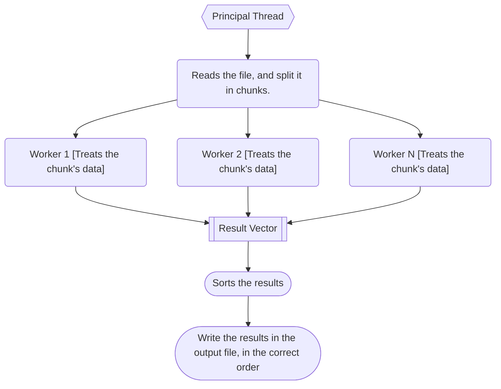

# Progression map

This file report the progress since the 29/06/2026 (called as DAY-1) on `Enkryptit!`. Basic features have already been done. Note that work is not necessarily done on consecutive days. (DAY-1 can be on monday, but DAY-2 on friday of the same week).
The progress report will follow this format :

```md
---

## D-N - Key implementations / progress

Summary.

+ Implementation 1
+ Implementation 2
+ Implementation N

Possible known issues

---
```

---

## DAY-1 - Continued /test/ ; corrected `/src/compression.rs`

Most of the tests had `todo!()`. Fixed it by creating the tests. Also created `/src/lib.rs` in `eck` so that we can use the intern functions from another binary.

+ Created the compression unit tests
+ Created the encryption primitives unit tests
+ Created the metadatas unit tests
+ encryption flow tests are in progress, not yet finished.
+ Added a *retry* logic in `compression.rs` when buffer is too small

Current result on `cargo test --test eck_tests -- --nocapture` :

```bash
test result: FAILED. 77 passed; 3 failed; 1 ignored; 0 measured; 0 filtered out; finished in 0.78s
```

It is perfectly normal : folder tests (not implemented) fail. 

---

## DAY-2 - Added folder encryption / decryption

I added the folder encryption, and refactorized the code in `/src/encryption/`. Anyway, tests for folder encryption remains to be done.

* Created `/src/encryption/folder_encryption/`
* Added in this directory : `entries.rs` for collecting entries from a folder with `walkdir`, `inter_archive_encryption.rs` for encrypting / decrypting files from the archive.
* completed folder encryption / decryption 
* completed `object_treatment.rs` for supporting folder encryption

Test results :

```bash
test result: FAILED. 77 passed; 3 failed; 1 ignored; 0 measured; 0 filtered out; finished in 0.19s
```

It is normal, since I didn't already implemented the folder encryption tests.

---

## DAY-3 - Took over the project, added tests, and added comments

I added new tests (for folder encryption, finally + rustdoc), fixed existing tests and added doc comments.

* Modified almost every file to add doc comments.
* Modified `/test/integration/*`

Test results :

```bash
test result: ok. 89 passed; 0 failed; 1 ignored; 0 measured; 0 filtered out; finished in 8.21s
```

I also modified README.

---

## DAY-4 Fixed an issue with folder encryption

I fixed an issue with the folder encryption, in `/treatment/folder_case.rs`. 
\
The fact was that if you wanted to encrypt `path/to/my/folder/`, it created `path/to/my/folder/.encky`. 
\
It is not a huge issue, but I added a `strip_suffix()`, so that now it creates `path/to/my/folder.encky` correctly.

Test results :

```bash
test result: ok. 89 passed; 0 failed; 1 ignored; 0 measured; 0 filtered out; finished in 6.71s
```

---

## DAY-5 Refactorization & addon

I did a huge refactorization in the code. Now, the frontend doesn't resolves the `key`. 
\
It passes an `EnkryptitContext` (*mutable*) to the backend, so that the backend resolves both `Key` and `KeyType` easily :

```rust
let enkryptit_key = EnkryptitKey::resolve(Mode::Decrypting, &metadatas.key_type, context, path)?;
// Or 
let enkryptit_key = EnkryptitKey::resolve(Mode::Encrypting, &key_type, context, path)?;
```

The `Key` and `KeyType` are now, in the backend, wrapped in `EnkryptitKey`, a more secure structure (`Zeroize` on drop, and calls `EnkryptitContext::resolve` wich contains the password as `Zeroizing<>`. Also, the key is *Locked* (`mlock`)).
\
Because of these refactorizations, the code is now easier to read (and to maintain), but also allows the user to do :
```bash
eck myfile.txt myfile2.txt
eck myfolder/*
```

> Many files can be encrypted with one command now.

This is possible because of `pub fn treat_objects_with_multiple_paths()` and the modification of the Cli's arguments (`Vec<String>` for paths instead of `Option<String>`.)
\
Files added :
- frontend/params_helper.rs
\
frontend/mod.rs
\
frontend/treat_output.rs
\
frontend/treatment.rs
\
frontend/tui.rs (moved)
\
frontend/cli.rs (moved)

- context.rs
- key/derivation.rs
\
key/generation.rs
\
key/mod.rs
\
key/resolve.rs
\
key/storage.rs

- Files modified : Almost all, except `compression`, `metadatas`, `parameters` and `encryption_primitives`.

Test results :

```bash
test result: ok. 88 passed; 0 failed; 1 ignored; 0 measured; 0 filtered out; finished in 7.63s
```

(But many tests are deprecated)

---

## DAY-6 Ergonomic addon 

Added a `Browse` section in the TUI that uses `rfd` (Rusty Files Dialogs), and allows the users to now browse their **files** and **folders**.

- Files modified : frontend/tui.rs
- Functions added :
    - pub fn launch_browser() -> Result<(), EnkryptitError> {} (launches the browser menu)
    - fn browse_files() -> Result<(), EnkryptitError> {} (opens the `Browse Files` pop-up, and treats the selected objects)
    - fn browse_folders() -> Result<(), EnkryptitError> {} (opens the `Browse Folders` pop-up, and treats the selected objects)
    - fn browse_files_then_folders() -> Result<(), EnkryptitError> {} (opens the `Browse Files` pop-up, then the `Browse Files` pop-up, combines the two results, and treats the selected objects)

Test results :

```bash
test result: ok. 88 passed; 0 failed; 1 ignored; 0 measured; 0 filtered out; finished in 5.21s
```

But **too many** tests are deprecated, and I need to add test for :
- testing `eck /myfile.rs /myfolder/ /myfolder2/*`
- tests for the `EnkryptitContext` (password resolution, essentially)
- tests for `EnkryptitKey`
- tests for the `Browse` section

---

## DAY-7 Frontend refactorization + Added tests

Modified `/frontend/`. It is now compound of `/cli`, `/tui` and `treat_output.rs`.
\
All the **Cli** code has been grouped in `/cli`, and all the **Tui** code has been grouped in `/tui`.
\
Added `EnkryptitTuiAction` enum, used by `launch_ui()`. It makes the code cleaner and will help for future tests.
\
Added `9` tests that cover the *tui actions*, and cover more the tests related to *cli* (`cli_tests.rs`).

Test results :

```bash
test result: ok. 97 passed; 0 failed; 1 ignored; 0 measured; 0 filtered out; finished in 6.94s
```

---

## DAY-8 Added Multithreading when encrypting a file, updated the format and added tests

Added `ParallelismType` in `types.rs`, and a `parallelism` field in *parameters*.
\
Also added a new argument in Cli and a new `Select` in Tui for choosing Parallelism type (and possibly threads number).
\
Added `/parallelism/`, that defines the *workers*, *jobs*, *workers pool*... for treating task with multithreading.
\
Added `encrypt_chunk_job`, a new abstraction (same level as `encryption_flow`) used by multithreading.
\
Added `/encryption/file_encryption/multithread.rs` that allows us to encrypt / decrypt file using this *pool*.
The architecture is :


\
Also, updated the format : `ENK1END` is now outside a chunk.
\
Added `integration` tests (`encrypt_chunk_job`) and `unit` tests (`parallelism`).
\
Test results :
```bash
test result: ok. 130 passed; 0 failed; 1 ignored; 0 measured; 0 filtered out; finished in 8.58s
```

I also did a little benchmark :
\
**Setup**: Same 2 GB incompressible random file (/dev/urandom), NoComp compression, password key, isolated configs. 3 runs each, means reported.
\
Modes : `Single` and `Multi` (8 threads)
\
Measures :
- Encryption: 8.43s --> 2.67s (3.16x faster)
- Decryption: 8.08s --> 2.52s (3.21x faster)
- Overall: 16.5s --> 5.18s on the 2 GB file

> [!NOTE]
> Multithreading gives ~3.2x on 8 threads rather than 8x. This is expected : the per-chunk XChaCha20 encryption work is small relative to the total 2 GB of disk I/O (read + write), which is the bottleneck and stays single-stream. The thread pool also serializes merging. Still, a solid ~3x win for both directions.

We need, now, to :
- update READMEs (tests + repo's README)
- benchmark
- extend parallelism (for folder archives)

--- 

## DAY-9

Modified frontend to enable the creation of tests (mock tests) :

- `src/frontend/tui/input.rs` (new): public `TuiInput` trait + `RealTuiInput` (real inquire/rfd). All interactive reads route through it.
- `tui/mod.rs`: launch_ui(input) — main loop now drives input.select(); dispatch Encrypt/Params/Help/Browse/Exit.
- `tui/action.rs`: execute(input) threads input through; from_str unchanged.
- `tui/treatment.rs`: handle_object_treatment(input) + handle_object_treatment_with_password(input, pwd) seam (password bypasses the prompt for headless roundtrips).
- `tui/parameters.rs`: launch_params(input) using input.select/input.custom_counter for compression/key/parallelism/threads.
- `tui/browse.rs`: launch_browser(input) + public browse_files/browse_folders/browse_files_then_folders(input, password) using input.pick_files/pick_folders; shared treat_objects helper.
- `main.rs`: passes &RealTuiInput to launch_ui.

Of course, addded new tests (*16*) :

- `/mocks/tui_input.rs`
- `integration/tui_test.rs`
- `integration/tui_flow.rs`

Also modified the `show_parameters` macro (now a function that also prints the *Parallelism Type*).
\
\
Created `/doc` (empty for now).

> [!NOTE]
> I created a new / stylish progress bar for Enkryptit... but I found it so useful that I decided to make it an entire crate.
> The crate is [`gradient-bar`](github.com/VRAM-RAM/gradient-bar)

Tests result :
```bash
test result: ok. 146 passed; 0 failed; 1 ignored; 0 measured; 0 filtered out; finished in 14.05s
```

Todo : Modify how folder encryption works (especially error handling & progress bar)

--- 

## DAY-10 Added `Auto` compression type : Enkryptit resolves the compression to use.

Added an `Auto` *CompressionType* : Enkryptit can infer the *CompressionType* to use, basing on :

- The size of the file
- It's Mime extension

Created `/context` (`context.rs` --> `/context`)
\
Added tests & modified existing ones.
\
Added the possibility to choose `Auto` in both *Cli* and *Tui*.
\
Also added an `Auto` *ParallelismType*.
\
Next steps : 

- Also add *Parallelism* inference, but for folders
- Implement *multithreading* in intern entry encryption
- Implement *multithreading* in folder encryption itself (entries in parallel)
- Added tests

Test results :
```bash
test result: FAILED. 155 passed; 4 failed; 1 ignored; 0 measured; 0 filtered out; finished in 14.67s
```

---

## DAY-11 Fixed and issue with `Auto` CompressionType, added multithreading when encrypting/decrypting an entry of a folder

Modifications :
- Fixed an issue with `CompressionType::Auto` resolution in `folder_encryption/`
- To fix it, and to make the architecture cleaner, created `/encryption/folder_encryption/collect_entry.rs`
- Refactorization of `folder_encryption/` :
    - created a directory for entries (`entry/`)
    - created `intern_archive_encryption` that will contain the code for both multithreading and singlethread encryption / decryption.
    - simplified `decrypt_folder()` and `encrypt_folder()` : those functions will only resolve if the folder has to be treated with multithreading or singlethread, and then delegate the treatment to `de/encrypt_folder_single` or `de/encrypt_folder_multi`
- Added mulithreading when encrypting a folder (inside the entry encryption) : Now, `de/encrypt_folder_single` resolves the parallelism type and chooses between `encrypt_single_file_into_archive()/encrypt_multithreading_file_into_archive()` and `decrypt_single_file_from_archive()/decrypt_multithreading_file_from_archive()`.

Tests results :
```bash
test result: ok. 159 passed; 2 failed; 1 ignored; 0 measured; 0 filtered out; finished in 12.36s
```

Todo :

- Add a smooth skipping message / error system for folder encryption
- Add a logging system
- Implement folder multithreading encryption (multiple files at the same time)

---

## DAY-12 Architectural changes of encryption, including modification of `intern_archive_encrytption`,  creation of `encryption/chunk_job/`

- Modified `encryption/folder_encryption/intern_archive_encryption/` : now contains, in `mod.rs`, the code for treating a `FileEntry`. It makes `folder_encryption/single.rs` much more simpler :

```rust
use crate::{context::EnkryptitContext, encryption::{encrypt_chunk_job::{DecryptChunkJob, EncryptChunkJob}, folder_encryption::intern_archive_encryption::{treat_entry_decryption, treat_entry_encryption}}, errors::EnkryptitError, key::EnkryptitKey, metadatas::FileEntry, parallelism::pool::EnkryptitPool};

pub fn encrypt_folder_single(folder_path: &str, key: EnkryptitKey, entries: &mut Vec<FileEntry>, offset: u64, context: &mut EnkryptitContext, archive_path: &str) -> Result<(), EnkryptitError> {
    let mut current_offset = offset;
    let mut pool: Option<EnkryptitPool<EncryptChunkJob>> = None;

    for entry in entries {
        current_offset += treat_entry_encryption(&mut pool, folder_path, entry, current_offset, context, archive_path, &key)?;
    }

    Ok(())
}

pub fn decrypt_folder_single(archive_path: &str, dest_folder: &str, entries: &Vec<FileEntry>, key: EnkryptitKey, payload_offset: u64, version: u8, context: &mut EnkryptitContext) -> Result<(), EnkryptitError> {
    let mut pool: Option<EnkryptitPool<DecryptChunkJob>> = None;

    for entry in entries {
        treat_entry_decryption(&mut pool, version, dest_folder, &entry, context, archive_path, &key, payload_offset)?;
    }

    Ok(())
}
```

- Splitted `encryption/encrypt_chunk_job.rs` into `encryption/chunk_job/` that contains :
    - `decrypt.rs` : `DecryptChunkJob` and its implementation.
    - `encrypt.rs` : `EncryptChunkJob` and its implementation.
    - `mod.rs` : **Module** file, that exposes two helpers for submitting a decryption job or an encryption job.
    - `result.rs` : `ChunkResult` structure

- Created `encryption/file.rs`, that contains an helper for reading & treating files.
- Modified almost every file in `/encryption/file_encryption/` and `/encryption/folder_encryption/` to match the new architectural changes.

Test results:

```bash
test result: ok. 159 passed; 0 failed; 1 ignored; 0 measured; 0 filtered out; finished in 14.96s
```

Todo :

- Add a smooth skipping message / error system for folder encryption
- Add a logging system
- Continue implementing folder multithreading encryption (multiple files at the same time)

---

## DAY-13 Added tests for testing all the architectural changes done since DAY-9 & changed the progress bar display

Added :
1. **Auto parallelism** - test/unit/parallelism.rs: boundary tests for size-based inference (Single → MT 4/6/8/cpus at the 4 size gates), explicit non-Auto short-circuit, and path-based resolution on real/sparse files.
2. **chunk_job helpers** - submit_encrypt_chunk to submit_decrypt_chunk roundtrip through a real pool.
3. **collect_entry** - test/unit/folder_entries.rs (new): relative path + perms, root → DirectoryIsFolder, subdir → FileIsASymLink, symlink-to-file accepted.
4. **collect_folder_entries** - concrete per-entry compression (XML needs to return Zstd, WAV => Lz4, PNG => NoComp), empty folder, nested relative paths.
5. **read_file** - test/unit/file.rs (new): len, estimated_steps, zero-length, missing path.
6. **Folder metadata** — test/unit/metadatas.rs: FileEntry/FolderMetadata pack-unpack preserving the new per-entry compression field (field-by-field, since eq skips it).
7. **Auto** + **Auto** end-to-end regression — test/integration/folder_encryption.rs: mixed-content folder (XML/WAV/PNG + 55 MiB sparse file) roundtrips byte-exact; asserts offsets start at 65 and no raw Auto leaks into entry metadata.
8. **CLI** — `--compression auto` and `--parallelism` auto persist to config and display.

Moved the `GradientProgressBar` creation from `encryption_flow` to outside of it. Now, it checks if we have a bar (`.is_some()`) and in that case, updates it. It allows us not to create a bar when encrypting / decrypting an entry of a folder in `intern_archive_encryption`.
\
\
Changed version from `0.0.2` to `0.0.3`.
\
\
Tests results : 
```bash
test result: ok. 187 passed; 0 failed; 1 ignored; 0 measured; 0 filtered out; finished in 14.86s
```

I also choosed what to do next : I'll give up with multithreading folder encryption, because I think the I/O & RAM & Complexity (of the code) costs will be too high for a little of performance gains. Instead, we'll create :
- Cleanup & Polish (no more *eprintln!()*, logging system, smooth skipping, `--json` mode...)
- Ergonomic add-ons (`eck verify <path>`, `eck inspect <path>`, `eck recover <path>`)
- Doc restructure (README + /doc, and later *mkdocs* maybe)
- cargo clippy / fuzzy testing
- benchmarks
